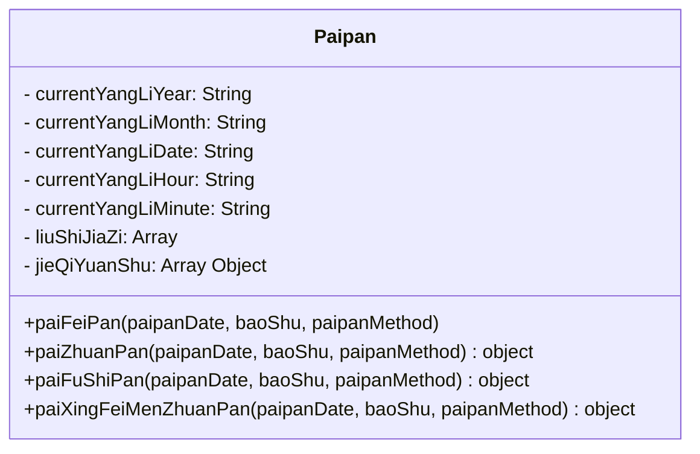

所有盘局函数返回值结构

```js
{
  // 时间参数
  paiPanDate: String,

  paiPanNianZhu: String,
  paiPanYueZhu: String,
  paiPanRiZhu: String,
  paiPanShiZhu: String,

  jieQi: String,
  zhiFu: String,
  zhiShi: String,
  wuBuYuShi: boolean,
  tianJiaShi: boolean,
  yinYangDun: String,
  juShu: number,

  // 盘局参数
  yiGong: {
    tianPanShen: String,
    xing: String,
    men: String,
    diPanShen: String,
    tianPanGan: String,
    jiGongTianGan: String, // 转盘参数
    tianPanJia: boolean // 飞盘参数
    diPanJia: boolean // 飞盘参数
    diPanGan: String,
    angan: String,
    anZhi: String,
    tianPanGanZhangSheng: String,
    diPanGanZhangSheng: String,
    jiGongTianGanZhangSheng: String,
    menWangShuai: String,
    xingWangShuai: String,
    gongWangShuai: String,

    // 格局参数
    zhengGe: String, // 飞盘参数
    fuge: String, // 飞盘参数
    qige: String, // 飞盘参数
    pianGan: String, // 飞盘参数
    menGong: String,
    shiGanKeYing: String, // 转盘参数
    jiXiongGe: String, // 转盘参数

    // 其他参数
    shenSha: String[] // 飞盘参数
    zhouYou: String[] // 飞盘参数
  }
}
```
